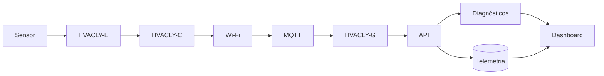

# HVACLY

Plataforma para aquisição, transporte, organização e interpretação de dados operacionais de sistemas de climatização e refrigeração. O HVACLY conecta sensores e equipamentos a uma camada de telemetria, diagnóstico e visualização, mantendo rastreabilidade entre o ativo físico, o dado coletado e a conclusão técnica.

## Objetivo

O objetivo do HVACLY é transformar telemetria de HVAC-R em informação operacional verificável. A plataforma deve permitir identificar ativos, coletar medições, transportar dados com segurança, detectar anomalias, apoiar diagnósticos e disponibilizar informações para APIs e dashboards.

O sistema não deve inventar sensores, unidades, capacidades ou estados de equipamento. Quando a informação não estiver confirmada por documentação, configuração ou medição, ela deve ser classificada explicitamente como hipótese ou item a validar.

> **Princípio central:** telemetria sem identidade, unidade, instante e origem não é evidência técnica completa.

## Arquitetura conceitual



A cadeia principal é:

```text
sensor
    ↓
HVACLY-E / HVACLY-C
    ↓
rede de comunicação
    ↓
MQTT
    ↓
HVACLY-G
    ↓
API e armazenamento
    ↓
diagnóstico e dashboard
```

Os nomes HVACLY-E, HVACLY-C e HVACLY-G representam papéis arquiteturais. O hardware, o firmware, a pinagem e os protocolos de cada papel somente devem ser considerados confirmados quando houver documentação ou evidência correspondente.

## Escopo

O projeto contempla:

- cadastro de ativos, nós e sensores;
- aquisição de temperatura, pressão, corrente, tensão, umidade e outras grandezas aplicáveis;
- identificação de unidade e qualidade da medição;
- transporte de mensagens por MQTT;
- gateway para integração entre campo e serviços;
- API de ativos, sensores e telemetria;
- armazenamento de dados brutos e normalizados;
- diagnóstico baseado em medições e contexto do equipamento;
- dashboards operacionais;
- testes de conectividade, integridade e compatibilidade.

O projeto não deve substituir manual de fabricante, procedimento de segurança, norma aplicável ou avaliação profissional em campo.

## Estrutura prevista

```text
hvacly/
├── README.md
├── sensores/                  # Definições e cadastro dos sensores
├── nodes/
│   ├── hvacly-e/              # Aquisição e interface com sensores
│   ├── hvacly-c/              # Controle, comunicação ou concentração local
│   └── hvacly-g/              # Gateway de integração
├── telemetria/                # Modelos, séries temporais e qualidade dos dados
├── mqtt/                      # Tópicos, payloads e regras de transporte
├── gateway/                   # Integração entre campo, rede e serviços
├── api/                       # Contratos e endpoints
├── diagnosticos/              # Regras, hipóteses e resultados diagnósticos
├── dashboard/                 # Visões operacionais e técnicas
└── schemas/                   # Schemas versionados de dados
```

## Modelo de domínio

O HVACLY deve manter relações explícitas entre os seguintes elementos:

```text
asset
    ↓
node
    ↓
sensor
    ↓
measurement
    ↓
telemetry event
    ↓
diagnostic
```

### Asset

Representa o equipamento ou sistema monitorado. Deve possuir identificador estável e, quando disponível, vínculo com fabricante, modelo, capacidade, refrigerante, local de instalação e cadastro de produto.

### Node

Representa o dispositivo de aquisição, controle ou gateway. Deve registrar identidade, firmware, versão de configuração, conectividade e relação com o ativo monitorado.

### Sensor

Representa o canal físico ou lógico que produz uma medição. Deve registrar grandeza, unidade, faixa, precisão conhecida, método de aquisição, estado de calibração e vínculo com o node.

### Measurement

Representa o valor medido em um instante. Uma medição completa deve conter valor, unidade, timestamp, sensor, asset, origem, qualidade e, quando aplicável, valor bruto e valor convertido.

### Diagnostic

Representa uma interpretação baseada em telemetria, contexto técnico, histórico e evidências adicionais. Diagnósticos devem separar observações, cálculos, hipóteses, testes recomendados e conclusão.

## Evidência e qualidade dos dados

As medições e conclusões devem usar as classificações abaixo:

| Classificação | Aplicação |
|---|---|
| `CONFIRMADO` | O dado ou fato é sustentado por fonte, configuração ou medição confiável. |
| `PROVÁVEL` | A interpretação é fortemente apoiada, mas ainda requer confirmação. |
| `DERIVADO` | O resultado foi calculado a partir de dados conhecidos. |
| `HIPÓTESE` | A explicação é possível, mas ainda não foi testada. |
| `NÃO DISPONÍVEL` | A informação necessária não foi encontrada. |
| `A VALIDAR` | É necessária inspeção, medição, calibração ou confirmação documental. |

Cada evento de telemetria deve permitir responder:

- qual ativo foi medido;
- qual node e sensor produziram o dado;
- qual grandeza e unidade foram utilizadas;
- quando a medição ocorreu e quando foi recebida;
- qual era a origem do dado;
- se houve conversão, filtragem ou agregação;
- qual é a qualidade e a validade do valor;
- qual evidência ou configuração sustenta a interpretação.

A plataforma deve preservar o dado bruto. Dados normalizados, agregados ou corrigidos precisam manter referência ao evento original e à transformação aplicada.

## MQTT e contratos de mensagem

A convenção de tópicos e payloads deve ser versionada. Um tópico deve tornar explícitos o ambiente, o ativo, o node, o sensor e o tipo de mensagem, sem depender de nomes ambíguos.

Um payload de telemetria deve declarar, no mínimo:

```json
{
  "schemaVersion": "1.0",
  "assetId": "asset-001",
  "nodeId": "node-001",
  "sensorId": "sensor-001",
  "measuredAt": "2026-01-01T12:00:00Z",
  "receivedAt": "2026-01-01T12:00:01Z",
  "quantity": "temperature",
  "value": 23.4,
  "unit": "degC",
  "quality": "CONFIRMED",
  "source": "hvacly-e"
}
```

O exemplo é um contrato ilustrativo. Campos, nomes de unidades, tópicos e regras de QoS devem ser definidos nos arquivos de schema do projeto antes de serem tratados como interface estável.

## API

A API deve ser orientada por contratos versionados e preservar compatibilidade entre clientes. Um endpoint de telemetria deve ser delimitado por requisito, schema e testes, por exemplo:

```text
GET /api/v1/assets/{assetId}/telemetry
```

Toda implementação deve informar:

- schema de entrada e saída;
- filtros e paginação;
- unidade e resolução temporal;
- tratamento de dados ausentes;
- códigos de erro;
- autenticação e autorização;
- testes automatizados;
- compatibilidade com versões anteriores.

## Diagnóstico

O diagnóstico deve seguir a cadeia:

```text
sintoma
    ↓
observação
    ↓
medição
    ↓
comparação com referência
    ↓
hipótese
    ↓
teste de validação
    ↓
conclusão
```

Uma anomalia detectada por regra não é automaticamente uma falha de componente. O resultado deve indicar quais dados sustentam a anomalia, quais variáveis estão ausentes e qual teste pode confirmar ou rejeitar a hipótese.

## Segurança e confiabilidade

Os nós e gateways devem ter identidade própria, configuração versionada e controle de acesso. O transporte deve considerar autenticação, autorização, integridade, replay, perda de conexão e reprocessamento de mensagens.

A plataforma deve tolerar mensagens duplicadas, atrasadas ou fora de ordem sem produzir diagnósticos inconsistentes. Eventos descartados ou corrigidos devem ser registrados com motivo.

## Fluxo de desenvolvimento

```text
requisito
    ↓
contexto do ativo e do repositório
    ↓
contrato de dados
    ↓
implementação
    ↓
teste de unidade e integração
    ↓
validação de telemetria
    ↓
auditoria
```

Antes de alterar código ou schemas:

1. Inspecione o estado atual.
2. Identifique arquivos, contratos e dependências afetados.
3. Descreva a alteração e os riscos de compatibilidade.
4. Atualize ou crie testes.
5. Execute a validação.
6. Registre limitações e resultados.

## Roadmap

### Fundação

Definir o modelo de asset, node, sensor e measurement. Criar os schemas versionados e a política de nomenclatura.

### Aquisição

Documentar as interfaces dos sensores, os nós HVACLY-E e HVACLY-C, o tratamento de falhas e a persistência do dado bruto.

### Transporte

Definir tópicos MQTT, payloads, QoS, retenção, autenticação e comportamento em perda de conexão.

### Gateway e API

Implementar o HVACLY-G, a ingestão de eventos, os endpoints versionados e os testes de contrato.

### Diagnóstico e dashboard

Criar regras rastreáveis, histórico de eventos, visualizações de qualidade e mecanismos para distinguir anomalia de diagnóstico confirmado.

## Critérios de aceitação

O projeto será considerado operacional quando:

- todo dado estiver relacionado a um asset, node e sensor identificáveis;
- grandeza, unidade, timestamp e origem forem obrigatórios;
- dados brutos puderem ser recuperados;
- schemas e contratos tiverem versionamento;
- mensagens duplicadas, atrasadas e inválidas forem tratadas;
- APIs tiverem testes de contrato;
- diagnósticos preservarem as evidências e hipóteses que os sustentam;
- dashboards exibirem a qualidade e a atualidade dos dados;
- alterações incompatíveis forem identificadas antes da publicação.

## Como contribuir

Novos sensores, nodes, tópicos, endpoints e regras de diagnóstico devem incluir documentação, schema, testes e exemplos. Não registre uma unidade, pinagem, capacidade ou comportamento de equipamento sem fonte ou evidência.

Quando houver incerteza, use `A VALIDAR` ou `HIPÓTESE` e descreva o teste necessário. Não corrija dados brutos de forma destrutiva. Registre transformações como operações reproduzíveis.

## Estado atual

Este repositório inicia a organização da arquitetura HVACLY. A implementação deve começar pelos schemas de identidade e telemetria, seguida pelos contratos MQTT e API, antes da expansão para diagnósticos e dashboards.

## Licença e responsabilidade técnica

A licença do projeto deve ser definida pelo mantenedor. Dados e diagnósticos devem ser validados contra documentação oficial, condições reais de instalação e procedimentos de segurança aplicáveis.

## Referências

Este README foi elaborado a partir da arquitetura técnica fornecida para o ecossistema HVAC-R. Não foram utilizadas fontes externas nesta versão.

[1]: ../pmoc/README.md "Integração com a camada PMOC"
